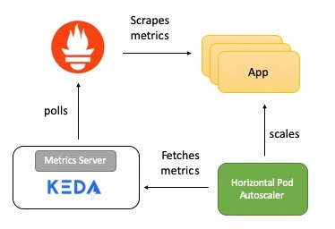

# k8s-prometheus-scaling

Kubernetes only gives support for auto-scaling based on CPU utilization. We are looking to have a more fine-grained way that enables us to base scaling on virtually any accessible metrics. The [sportsbook-api-nj](https://git.nonprod.williamhill.plc/sportsbook/sportsbook-api-nj) currently uses [Micrometer](https://micrometer.io/docs) that integrates very well with Spring Boot and registers [additional](https://docs.spring.io/spring-boot/docs/current/reference/htmlsingle/#production-ready-metrics-meter) metrics besides regular JVM-based ones. 

Prometheus, part of the [Cloud Native Computing Foundation](https://www.cncf.io/), is an open-source toolkit that provides monitoring and alerting for services and applications running in containers and its scheme for exposing metrics has become the de facto standard for Kubernetes. Prometheus also supports a large number of open source [exporters](https://prometheus.io/docs/instrumenting/exporters/), and projects like the [Prometheus operator](https://github.com/coreos/prometheus-operator) make it very easy to deploy within Kubernetes environments.                                                                                                                                                                   
Besides, [kube-state-metrics](https://github.com/kubernetes/kube-state-metrics) is also worth mentioning as it natively uses Prometheus metrics and provides useful metrics on the state and health of our Kubernetes objects that could help us better understand how our cluster operates under the hood.

# Objective

Build a Kubernetes cluster that will auto-scale our pods up and down based on anything that is accessible via Prometheus. Provided our pods are lightweight and volatile, support for service-discovery is crucial. 
We would also like to automate and minimize the effort for setting up deployments, scrape configs and scaling parameters.
To achieve all this we will use the following components: 

- [Prometheus Operator](https://github.com/coreos/prometheus-operator) - manages the Prometheus deployment, service discovery and dynamic configuration
- [KEDA](https://keda.sh/) - Kubernetes operator that drives auto-scaling using Prometheus metrics
- [mock-sportsbook-api](https://git.nonprod.williamhill.plc/pdinya/k8s-prometheus-scaling/tree/master/mock-sportsbook-api) - simple webapp used for demonstration purposes



# Tools

- [minikube](https://kubernetes.io/docs/tasks/tools/install-minikube/) 
- [kubectl](https://kubernetes.io/docs/tasks/tools/install-kubectl/#install-kubectl-on-macos)
- [hey](https://github.com/rakyll/hey) 
- JDK8 or above

# Instructions

#### 1. Give minikube enough resources and start it
```
✗ minikube config set memory 4096
✗ minikube config set cpus 2
✗ minikube config set vm-driver virtualbox
✗ minikube start
```

#### 2. Make sure you can access your minikube cluster via kubectl 
```$xslt
✗ kubectl get namespaces
NAME              STATUS   AGE
default           Active   31s
kube-node-lease   Active   32s
kube-public       Active   32s
kube-system       Active   33s
```

#### 3. Start using the docker daemon inside your minikube instance  
```
✗ eval $(minikube docker-env) && docker -v
Docker version 19.03.2, build 6a30dfc
```

#### 4. Create a docker image for `mock-sportsbook-api` that exposes metrics for Prometheus
```
✗ cd mock-sportsbook-api
✗ ./mvnw clean package
✗ docker build -t sportsbook-api .
✗ cd ..
```
> You might need to use `-Dmaven.wagon.http.ssl.insecure=true` for your maven build to pull artifacts from Nexus.

#### 5. Deploy the application to k8s and verify that service is up and running
```
✗ kubectl apply -f sb-api-deployment.yaml
✗ curl $(minikube ip):30901/api
Hello from sb-api-6cb88df6d7-6fszf 
```

#### 6. Prometheus Operator RBAC
In order for Prometheus Operator to work in an RBAC based authorization environment, a ClusterRole with access to all the resources the Operator requires for the Kubernetes API needs to be created.

```
✗ kubectl apply -f prometheus-operator-cluster-roles.yaml
```
When Prometheus Operator boots up for the first time it registers the `customresourcedefinitions` it uses, therefore the create action on those is required.
```
...
rules:
- apiGroups:
  - apiextensions.k8s.io
  resources:
  - customresourcedefinitions
  verbs:
  - create
...
```
Prometheus Operator also requires all actions on those objects.
```
...
- apiGroups:
  - apiextensions.k8s.io
  resourceNames:
  - alertmanagers.monitoring.coreos.com
  - podmonitors.monitoring.coreos.com
  - prometheuses.monitoring.coreos.com
  - prometheusrules.monitoring.coreos.com
  - servicemonitors.monitoring.coreos.com
  - thanosrulers.monitoring.coreos.com
  resources:
  - customresourcedefinitions
  verbs:
  - get
  - update
- apiGroups:
  - monitoring.coreos.com
  resources:
  - alertmanagers
  - alertmanagers/finalizers
  - prometheuses
  - prometheuses/finalizers
  - thanosrulers
  - thanosrulers/finalizers
  - servicemonitors
  - podmonitors
  - prometheusrules
  verbs:
  - '*'
...
```
#### 7. Prometheus server RBAC
Prometheus server itself accesses the Kubernetes API to discover targets and `alertmanagers`. Therefore a separate ClusterRole for those Prometheus servers needs to exist.
```
✗ kubectl apply -f prometheus-cluster-roles.yaml
```

#### 8. Deploy Prometheus Operator and Prometheus Server
We are going to deal with the Operator first. We need to make sure it has deployed successfully before moving on to Prometheus Server as its CRD is registered by the Operator.
```
✗ kubectl apply -f prometheus-operator-deployment.yaml
✗ kubectl get pods -l app.kubernetes.io/name=prometheus-operator -o=jsonpath='{.items[0].status.phase}'
"Running"

✗ kubectl apply -f prometheus-deployment.yaml
✗ kubectl get pods
NAME                                   READY   STATUS    RESTARTS   AGE
prometheus-operator-5b49498f48-4qwtf   1/1     Running   0          18m
prometheus-prometheus-0                3/3     Running   1          99s
sb-api-6cb88df6d7-67kq6                1/1     Running   0          19m
sb-api-6cb88df6d7-wdqms                1/1     Running   0          19m
```

#### 9. Set up a ServiceMonitor
The `ServiceMonitor` CRD will define how `sb-api` should be monitored so Prometheus Operator can automatically generate scrape configuration. Notice that we are not required to manually provide Prometheus config.
```
✗ kubectl apply -f sb-api-service-monitor.yaml
```
To check out the dynamically set scrape config, visit `http://{minikube}:30900/config` where the host can be resolved by running `minikube ip`. 
You should see that the `ServiceMonitor` set up a job that uses [relabeling](https://prometheus.io/docs/prometheus/latest/configuration/configuration/#relabel_config) to rewrite targets for our pods before scraping. 
Now navigate to `http://{minikube}:30900/targets` to see the current state for our pods.

#### 10. Call the API to register some metrics
We are going to hit the `/api` endpoint 200 times with 10 concurrent workers
```
✗ hey -n 200 -c 10 http://$(minikube ip):30901/api
```
You can observe the metrics projected in a graph for each pod by executing this query: 
`sum(rate(http_server_requests_seconds_count{uri="/api"}[1m]))by (pod,uri)`


#### 11. Scale the API instances based on the number of requests
We are going to use KEDA short for Kubernetes-based Event Driven Autoscaler. 
The easiest way to deploy KEDA is with Helm:
```
✗ helm repo add kedacore https://kedacore.github.io/charts
✗ helm repo update
✗ kubectl create namespace keda
✗ helm install keda kedacore/keda --namespace keda
✗ kubectl get pods -n keda
NAME                                               READY   STATUS    RESTARTS   AGE
keda-operator-dbfbd6bdb-vfshx                      1/1     Running   0          5m25s
keda-operator-metrics-apiserver-8678f8c5d9-pkfzq   1/1     Running   0          5m25s
```
KEDA registers a CRD called `ScaledObject` that is the bridge between Prometheus and the HPA. 
`ScaledObjects` poll Prometheus for the desired performance metrics and supervise scaling of the Kubernetes deployment. The `ScaledObject` takes care of creating a corresponding HPA resource as well. 
Our intention is to up the number of pods by one on every extra 100 requests per second targeting `sb-api`.

Deploy the `ScaledObject` and see how the KEDA operator automatically picks up the new resource and creates the HPA for us.
```
✗ kubectl apply -f sb-api-scaled-object.yaml
✗ KEDA_POD_NAME=$(kubectl get pods -n keda -l app=keda-operator -o=jsonpath='{.items[0].metadata.name}')
✗ kubectl logs $KEDA_POD_NAME -n keda
...
{"level":"info","ts":1584486869.7718344,"logger":"controller_scaledobject","msg":"Reconciling ScaledObject","Request.Namespace":"default","Request.Name":"sb-api-scaler"}
{"level":"info","ts":1584486869.7719383,"logger":"controller_scaledobject","msg":"Adding Finalizer for the ScaledObject","Request.Namespace":"default","Request.Name":"sb-api-scaler"}
{"level":"info","ts":1584486869.7794535,"logger":"controller_scaledobject","msg":"Detected ScaleType = Deployment","Request.Namespace":"default","Request.Name":"sb-api-scaler"}
{"level":"info","ts":1584486869.7795086,"logger":"controller_scaledobject","msg":"Creating a new HPA","Request.Namespace":"default","Request.Name":"sb-api-scaler","HPA.Namespace":"default","HPA.Name":"keda-hpa-sb-api"}
```

#### 12. Put the API on load

Currently we should have 2 `sb-api` pods running which enables us to handle 200 requests per second without any need for scaling. 
```
✗ kubectl get pods
NAME                                   READY   STATUS    RESTARTS   AGE
prometheus-operator-5b49498f48-4qwtf   1/1     Running   0          4h9m
prometheus-prometheus-0                3/3     Running   1          3h52m
sb-api-6cb88df6d7-67kq6                1/1     Running   0          4h10m
sb-api-6cb88df6d7-z4258                1/1     Running   0          4h48s
```
 
Now let's call `/api` 250 times a second for 3 consecutive minutes and see how the service scales out automatically. 
```
✗ hey -q 25 -c 10 -n 45000 http://$(minikube ip):30901/api
```
> 25 requests made by 10 workers every second adds up to 250. The total number of requests to execute is 45000, i.e. 45000/250=180, therefore our script will run for 180 seconds.

```
✗ kubectl describe hpa keda-hpa-sb-api
Name:                                         keda-hpa-sb-api
Namespace:                                    default
Labels:                                       app.kubernetes.io/managed-by=keda-operator
                                              app.kubernetes.io/name=keda-hpa-sb-api
                                              app.kubernetes.io/part-of=sb-api-scaler
                                              app.kubernetes.io/version=1.3.0
Reference:                                    Deployment/sb-api
Metrics:                                      ( current / target )
  "access_frequency" (target average value):  125 / 100
Min replicas:                                 2
Max replicas:                                 10
Deployment pods:                              2 current / 3 desired
Conditions:
  Type            Status  Reason              Message
  ----            ------  ------              -------
  AbleToScale     True    SucceededRescale    the HPA controller was able to update the target scale to 3
  ScalingActive   True    ValidMetricFound    the HPA was able to successfully calculate a replica count from external metric access_frequency(&LabelSelector{MatchLabels:map[string]string{deploymentName: sb-api,},MatchExpressions:[]LabelSelectorRequirement{},})
  ScalingLimited  False   DesiredWithinRange  the desired count is within the acceptable range
Events:
  Type    Reason             Age   From                       Message
  ----    ------             ----  ----                       -------
  Normal  SuccessfulRescale  6s    horizontal-pod-autoscaler  New size: 3; reason: external metric access_frequency(&LabelSelector{MatchLabels:map[string]string{deploymentName: sb-api,},MatchExpressions:[]LabelSelectorRequirement{},}) above target
```
Our `ScaledObject` successfully notified the corresponding HPA that the threshold for `access_frequency` had been exceeded and an additional pod is now required for the deployment. 

In our example the PromQL query `sum(rate(http_server_requests_seconds_count{uri="/api"}[1m]))` returns the aggregated value of the per-second rate of HTTP requests on `/api` as measured over the last minute. Since the threshold count is 100, there will be an additional Pod for every time the request count increases by 100 e.g. if the value is between 400 to 500, the number of Pods will be 5.


#### References
- [Kubernetes monitoring with Prometheus](https://sysdig.com/blog/kubernetes-monitoring-prometheus-operator-part3/)
- [Autoscaling Kubernetes apps with Prometheus and KEDA](https://itnext.io/tutorial-auto-scale-your-kubernetes-apps-with-prometheus-and-keda-c6ea460e4642)